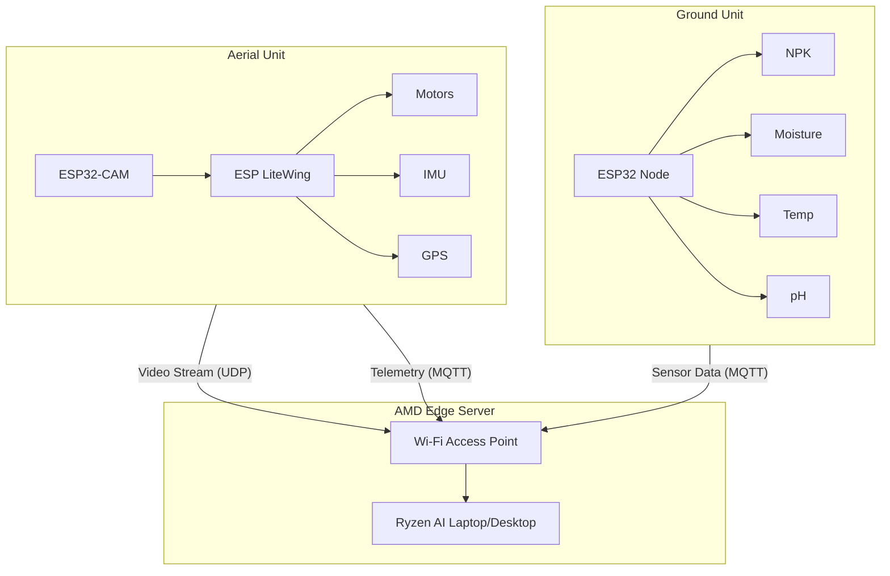

# AI-Based ESP LiteWing Drone for Crop Disease Analysis and Soil Intelligence with Edge Analytics

**Project Status:** Design Phase  
**Target Platform:** AMD Ryzen AI / ROCm Ecosystem  
**Hardware Stack:** ESP32 LiteWing (Drone), ESP32 (Ground Nodes)

---

## 1️⃣ SYSTEM OVERVIEW

### 1.1 The Problem
Modern agriculture faces two critical challenges:
1.  **Delayed Disease Detection:** Visual symptoms of crop diseases (like rust, blight, or nutrient deficiency) often appear too late for effective intervention. Manual field patrols are labor-intensive and error-prone.
2.  **Blind Soil Management:** Farmers often apply fertilizers uniformly without knowing the specific NPK (Nitrogen, Phosphorus, Potassium) needs of different soil patches, leading to waste and soil degradation.

### 1.2 The Solution
We propose a dual-layer intelligence system:
1.  **Aerial Layer:** An **ESP LiteWing-based drone** equipped with an ESP32-CAM surveys the field, capturing high-resolution images of crop foliage.
2.  **Ground Layer:** Stationary **IoT Soil Nodes** continuously monitor sub-surface conditions (NPK, Moisture, pH).
3.  **Edge Intelligence:** A local server (powered by **AMD Ryzen AI**) fuses aerial visual data with ground soil data to provide actionable insights, such as "Area A has fungal infection driven by excess moisture" or "Area B is yellowing due to Nitrogen deficiency, not disease."

---

## 2️⃣ HARDWARE ARCHITECTURE

### A. Aerial Unit (The Drone)
*   **Flight Controller:** **ESP LiteWing** (ESP32-S3 wireless drone development board).
    *   *Why LiteWing?* It integrates the microcontroller, motor drivers, and Wi-Fi capability into a single lightweight feather-sized board, reducing weight and complexity.
*   **Vision Sensor:** **ESP32-CAM** module linked to the LiteWing.
    *   Captures live video/images of crops.
*   **Navigation:**
    *   **IMU:** MPU6050 (Accelerometer + Gyroscope) for stabilization.
    *   **GPS:** BN-880 or NEO-6M for positioning and waypoint navigation.
    *   **Altimeter:** Barometer (BMP280) or Ultrasonic/LiDAR for altitude hold.
*   **Power:** 3.7V - 7.4V Li-Po Battery with Buck converter.

### B. Ground Unit (Soil Intelligence)
*   **Core:** Standard **ESP32 Dev Kit**.
*   **Sensors:**
    *   **NPK Sensor (RS485/Modbus):** Measures soil nutrient levels.
    *   **Capacitive Soil Moisture Sensor (v1.2):** Corrosion-resistant moisture reading.
    *   **DS18B20:** Soil Temperature.
    *   **pH Sensor:** For soil acidity/alkalinity.
*   **Power:** Solar panel + Li-Ion battery (18650) with TP4056 charging module.

### C. System Block Diagram

---

## 3️⃣ COMMUNICATION & DATA FLOW

### 3.1 Drone Communication
*   **Video Feed:** ESP32-CAM streams MJPEG frames over **UDP** or **WebSocket** to the server. Lower latency is prioritized over reliability.
*   **Telemetry:** Drone position, battery, and orientation sent via **MQTT** (Topic: `drone/telemetry`) every 100ms.
*   **Commands:** Server sends flight commands (Pitch, Roll, Yaw, Throttle) via **UDP/WebSocket** or MQTT (Topic: `drone/control`).

### 3.2 Ground Node Communication
*   **Sensor Data:** NPK, Moisture, pH readings sent via **MQTT** (Topic: `field/sensor/{id}`) every 30 minutes (to save power) or on-demand.

### 3.3 Server Fusion
*   **Local Edge Server:** Receives both streams. Syncs visual anomalies (detected at GPS location X,Y) with soil data from the nearest node (at GPS location X,Y).

---

## 4️⃣ AI & ANALYTICS (AMD ECOSYSTEM)
**Constraint:** Strict usage of AMD Free & Open Source Software.

### A. Infrastructure
1.  **Training:** **AMD ROCm (Radeon Open Compute)** on Linux.
    *   Used to accelerate PyTorch/TensorFlow training on AMD GPUs (e.g., Radeon RX series).
2.  **Inference:** **AMD Ryzen AI** / **Vitis AI**.
    *   Models are quantized (Int8) and compiled using the Vitis AI compiler for deployment on Ryzen AI NPU (Neural Processing Unit).
    *   Format: **ONNX** (Open Neural Network Exchange) for maximum portability.

### B. Models
1.  **Visual Model (Disease Detection):**
    *   **Architecture:** YOLOv8-Nano or MobileNetV3 (Optimized for speed).
    *   **Task:** Object Detection & Classification.
    *   **Classes:** Healthy, Rust, Blight, pest_damage.
    *   **Pipeline:** `ESP32-CAM MJPEG` -> `Python OpenCV` -> `Ryzen AI Inference (ONNX)` -> `Bounding Boxes`.
2.  **Tabular Model (Soil Intelligence):**
    *   **Architecture:** Random Forest Regressor or LightGBM.
    *   **Task:** Predict soil health score (0-100) and recommend fertilizer (in kg/hectare).
    *   **Inputs:** N, P, K values, Moisture %, pH.
    *   **Output:** Recommendation text (e.g., "Add Urea: 5kg").
3.  **Cross-Modal Fusion:**
    *   Logic: If `Visual_Disease == "Yellowing"` AND `Soil_Nitrogen == LOW`, THEN `Diagnosis = "Nitrogen Deficiency"` (Not viral disease).
    *   This prevents false positives in disease classification.

---

## 5️⃣ DASHBOARD & USER INTERFACE

### Tech Stack
*   **Frontend:** React (Vite) + Tailwind CSS (Glassmorphism design).
*   **Backend:** FastAPI (Python) - High performance async handling.
*   **Visualization:** Plotly.js (3D Surface maps for soil), Chart.js (Real-time sensor graphs).
*   **Comm:** Socket.io / WebSockets for real-time video and telemetry.

### Features
1.  **Mission Control:**
    *   Live Video Feed with bounding box overlays.
    *   Virtual Joystick for manual drone override.
    *   Map View (Leaflet.js) showing drone position and soil node locations.
2.  **Soil Analytics Panel:**
    *   Live gauges for NPK.
    *   Heatmap of soil moisture across the field.
3.  **AI Insights:**
    *   "Alerts" sidebar: "Warning: Early Blight detected in Sector 4."
    *   Fusion Diagnosis: "Recommended Action: Irrigation + 2kg Phosphorus."

---

## 6️⃣ CONTROL & AUTOMATION LOGIC

### 6.1 Flight Logic
*   **Stabilization:** PID Controller loop running on ESP LiteWing (1kHz loop).
    *   `Error = Desired_Angle - Current_Angle`
    *   `Output = P*Error + I*Integral + D*Derivative`
*   **Autonomous Survey:**
    *   **Lawnmower Pattern:** Drone flies in a zig-zag grid over the field boundaries defined in the dashboard.
    *   **Stop-and-Stare:** At every grid intersection, hover for 2 seconds to stabilize camera and capture a high-quality frame.

### 6.2 Failsafes
*   **Loss of Signal:** If "Heartbeat" packet from server missing > 3 seconds, drone enters "Land Now" mode.
*   **Low Battery:** If voltage < 3.5V/cell, Return to Home (RTH).

---

## 7️⃣ RESULTS & EVALUATION

### 7.1 Metrics
*   **Disease Detection Accuracy:** Mean Average Precision (mAP@0.5) > 85%.
*   **Latency:** Glass-to-glass latency (Camera to Dashboard) < 200ms using WebSockets.
*   **Soil Prediction:** RMSE (Root Mean Square Error) < 5% vs. lab tests.

### 7.2 Edge vs. Cloud
*   **Throughput:** Edge (Ryzen AI) processes 30 FPS locally vs. ~5 FPS on Cloud (due to upload bandwidth).
*   **Privacy:** Farm data stays local.

---

## 8️⃣ APPLICATIONS & FUTURE SCOPE

### 8.1 Applications
*   **Precision Agriculture:** Reducing chemical usage by targeting only sick plants.
*   **Organic Farming:** Monitoring certification requirements (soil health).
*   **Research:** Phenotyping for crop breeding.

### 8.2 Future Scope
*   **Swarm Technology:** Multiple LiteKings surveying 100+ acres.
*   **Automated Spraying:** Drone carries a small nozzle to spot-spray detected diseased areas immediately.
*   **Satellite Integration:** Validating drone data against Sentinel-2 satellite imagery.
